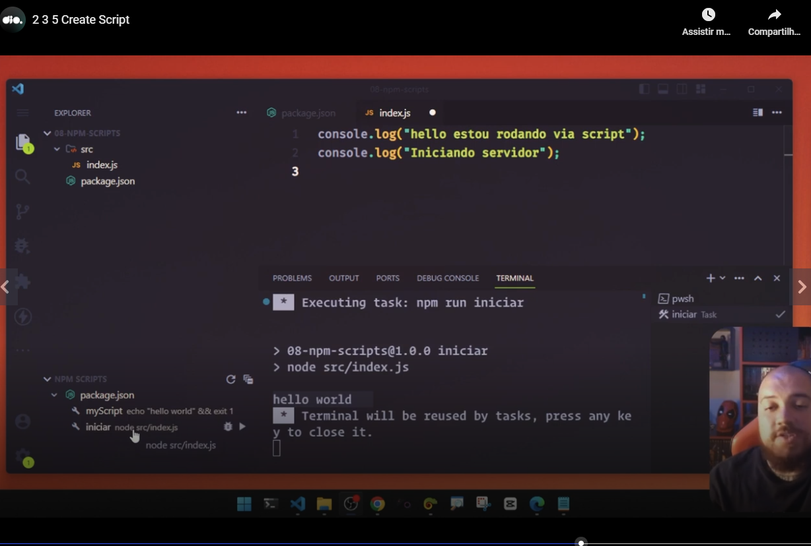
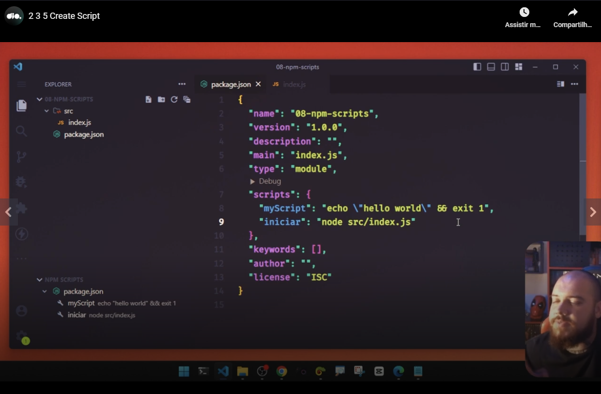
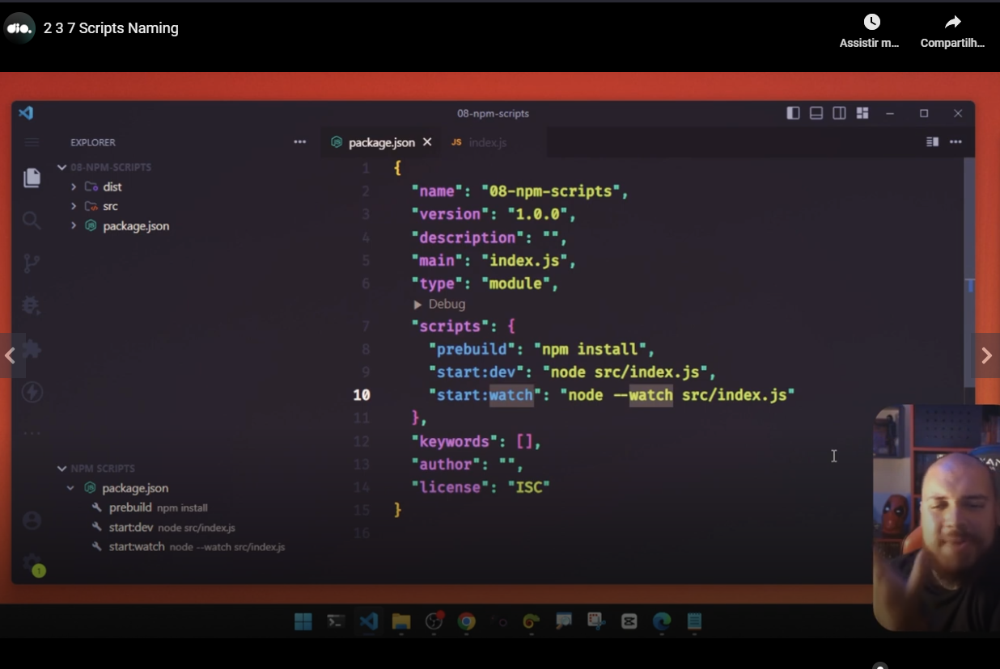

# Introduction

In this class teacher will talk about the scripts listed in the node 'scripts' of package.json.

You can run a package.json script directly in VSCode using the play button related to a script shówed in "NPM SCRIPTS" panel.

Here you can see the "scripts" node of package.json. You can see here if you need to use the Node.JS interpreter, you have to include it ('node' before the script name, considering that 'node' can be find through the PATH):

If you have to do more than 1 task in a script, you can concatenate the comands with "&&" (as in "myScript" line in the previous image) or make a script that do ths two things.

Here you can see some common script names. Note the use of double column in some script names:

Teacher explained that there is not an universal rule of naming conventions. But he suggested:

- to group the scripts by context using prefixes like "test:" or "start:";
